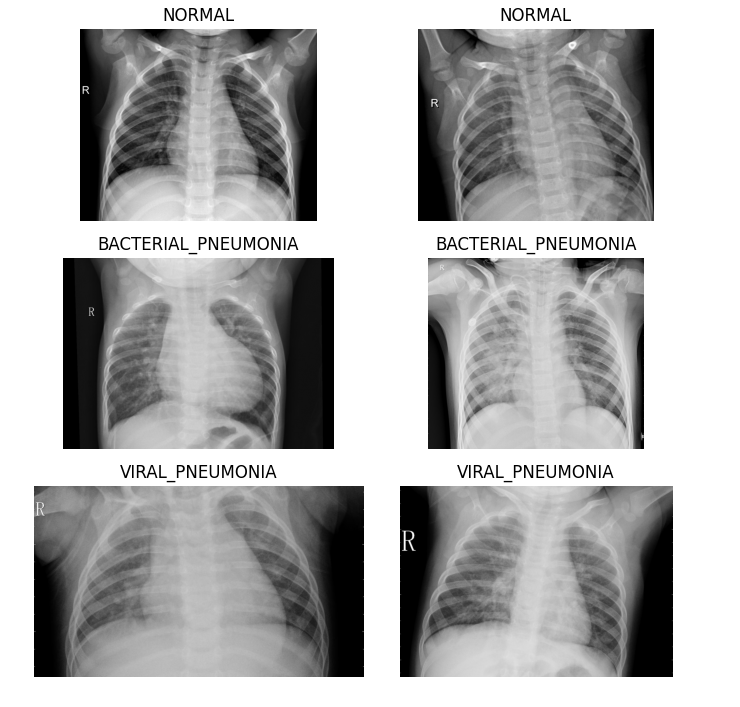
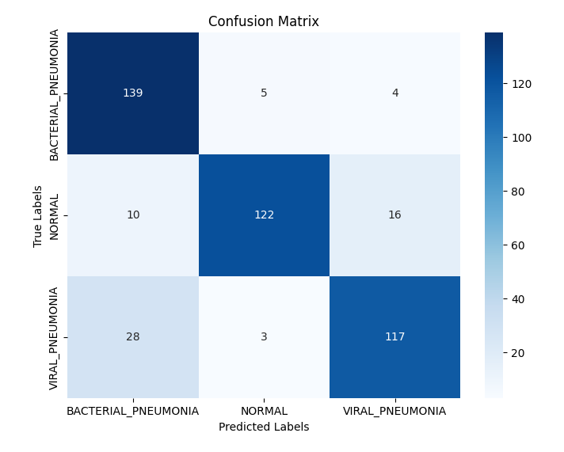
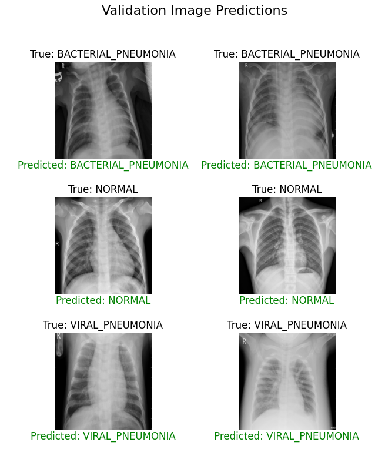
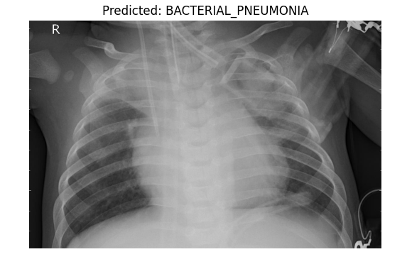

# 🩺 Pneumonia Detection from Chest X-Rays using Deep Learning

> **End-to-end Deep Learning Project | Computer Vision | Medical AI | PyTorch**

---

## 🚀 Project Summary (Recruiter Quick View)
This project presents a **production-oriented deep learning solution** for detecting **Pneumonia from Chest X-ray images** using **transfer learning with ResNet-18**. It demonstrates strong fundamentals in **computer vision, neural networks, data preprocessing, model evaluation, and inference workflows**, making it well-suited for **ML Engineer, AI Engineer, and Data Scientist portfolios**.

The system classifies X-ray images into **Normal** or **Pneumonia**, following an industry-standard machine learning pipeline.

---

## 🎯 Business & Technical Motivation
- Pneumonia is a critical respiratory condition where **early detection saves lives**
- Manual diagnosis from X-rays is **time-consuming and expertise-dependent**
- Deep learning models can assist clinicians by providing **fast, consistent second-opinion diagnostics**

This project focuses on building a **scalable, reusable, and interpretable baseline model** for medical image classification.

---

## 🧠 Key Skills Demonstrated
- Deep Learning with **PyTorch**
- **Transfer Learning** using pretrained CNNs
- Medical Image Preprocessing & Augmentation
- Model Training, Validation, and Testing
- Performance Evaluation & Visualization
- Reproducible ML Pipelines

---

## 🧩 Technical Approach

### 1️⃣ Data Preparation
- Chest X-ray images split into **Train / Validation / Test** sets



- Image preprocessing:
  - Resizing to ResNet input dimensions
  - Normalization using ImageNet statistics
- **Data augmentation** to reduce overfitting and improve generalization

### 2️⃣ Model Architecture
- **Base Model:** ResNet-18 (pretrained on ImageNet)
- **Customization:**
  - Early layers frozen to retain learned visual features
  - Final fully connected layer replaced with a **binary classifier**

### 3️⃣ Training Strategy
- Loss Function: **Cross-Entropy Loss**
- Optimizer: **Adam**
- Epoch-wise monitoring of training and validation metrics
- Best-performing model weights saved for inference

### 4️⃣ Evaluation & Inference
- Model evaluated on a held-out **test dataset**
- Generates predictions with confidence scores
- Visualizes predictions alongside original X-ray images





---

## 📊 Results
- Transfer learning significantly reduced training time
- Stable convergence and strong generalization on unseen data
## 🖼️ Sample Chest X-Ray Images


---

## ⚙️ How to Run
```bash
git clone https://github.com/your-username/pneumonia-xray-classification.git
cd pneumonia-xray-classification
pip install -r requirements.txt
jupyter notebook Pneumonia Diagnostic Assistant.ipynb
```

---

## 🔬 Engineering Highlights
- Clean modular pipeline
- Reusable pretrained weights
- Reproducible experimentation workflow

---


