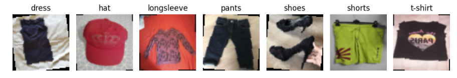
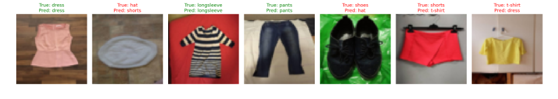
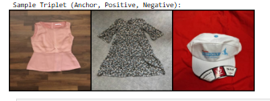
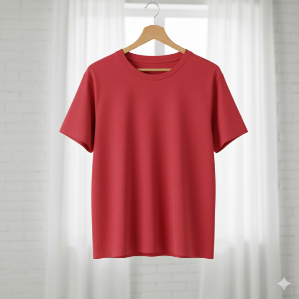

# 👗 Fashion Image Classification & Visual Search using MobileNet and Triplet Learning

## 📌 Overview
This project implements a **lightweight deep learning system** for **fashion image classification** and **visual similarity search** using **MobileNet-style architectures** and **metric learning (Triplet Loss)**.

The solution demonstrates **end-to-end deep learning expertise**, including:
- Custom CNN architecture design
- Efficient model building for constrained environments
- Metric learning for image retrieval
- Professional PyTorch training pipelines

The project is suitable for **real-world e-commerce, recommendation systems, and visual search engines**.




---

## 🎯 Key Objectives
- Classify fashion items accurately using a **MobileNet-inspired CNN**
- Learn **semantic image embeddings** for similarity-based retrieval
- Enable **visual search**: “Find items visually similar to this image”
- Maintain computational efficiency for **edge and mobile deployment**

---

## 🧠 Technical Highlights
- **Framework:** PyTorch
- **Architecture:** MobileNet-style CNN with Inverted Residual Blocks
- **Learning Paradigms:**
  - Supervised Classification
  - Metric Learning with Triplet Loss
- **Optimization:** Adam, AdamW
- **Data Augmentation:** Rotation, horizontal flipping
- **Loss Functions:**
  - Cross-Entropy Loss
  - Triplet Margin Loss
- **Evaluation:** Classification accuracy & nearest-neighbor retrieval

---

## 🏗️ Model Architecture

### 🔹 MobileNet-Inspired Backbone
The classifier uses **Inverted Residual Blocks**, inspired by MobileNetV2:

**Block Design**
- 1×1 Expansion Convolution
- 3×3 Depthwise Convolution
- 1×1 Projection Convolution
- Batch Normalization
- ReLU Activation
- Optional Residual Connection

This design significantly **reduces parameter count and computation**, making it ideal for real-time applications.


---

## 🧪 Part 1: Fashion Image Classification




### ✔️ Data Pipeline
- Images resized to **64×64**
- Normalized to range **[-1, 1]**
- Training augmentation:
  - Random horizontal flips
  - Random rotations

### ✔️ Training Configuration
| Parameter        | Value |
|------------------|-------|
| Optimizer        | Adam |
| Learning Rate    | 0.01 |
| Scheduler        | StepLR |
| Epochs           | 5 |
| Loss Function    | CrossEntropyLoss |

### ✔️ Output
- Trained classifier for multi-class fashion item recognition
- Efficient inference suitable for deployment

---

## 🔍 Part 2: Visual Search with Metric Learning

### 🔹 Problem Definition
Traditional classification does not capture **visual similarity**.
This module learns an **embedding space** where:
- Similar fashion items are close
- Dissimilar items are far apart

---

### 🧬 Triplet Learning Strategy
Each training sample consists of:
- **Anchor:** Reference image
- **Positive:** Same class as anchor
- **Negative:** Different class

The network is trained using **Triplet Margin Loss** to enforce semantic distances.




---

### ✔️ Training Configuration
| Parameter        | Value |
|------------------|-------|
| Optimizer        | AdamW |
| Learning Rate    | 0.001 |
| Loss             | TripletMarginLoss |
| Margin           | 1.0 |
| Epochs           | 5 |

---

## 🔎 Visual Search Pipeline
1. Encode all catalog images into embeddings
2. Encode query image
3. Compute Euclidean distances
4. Retrieve **Top-K visually similar items**

This simulates **real-world fashion search engines** used by e-commerce platforms.




---

## 🚀 Applications
- 🛒 E-commerce visual search
- 👗 Fashion recommendation systems
- 📱 Mobile and edge AI deployments
- 🧠 Content-based image retrieval (CBIR)

---

## 📈 Skills Demonstrated
- Deep Learning Architecture Design
- PyTorch Model Engineering
- Metric Learning & Representation Learning
- Efficient CNNs for Production
- Clean, modular, maintainable ML code

---

## 🧩 How to Run
```bash
pip install torch torchvision numpy matplotlib
jupyter notebook Clothing Classification and Visual Search.ipynb
```

---

## 📬 Contact
 🤝 Connect with Me

[](https://www.linkedin.com/in/injamamul-haque-alve-8b7306235/)

