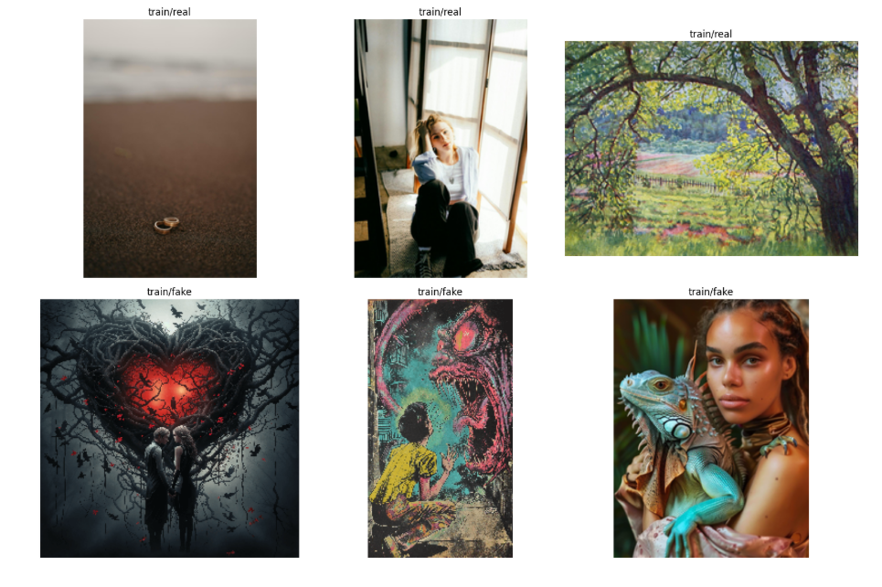
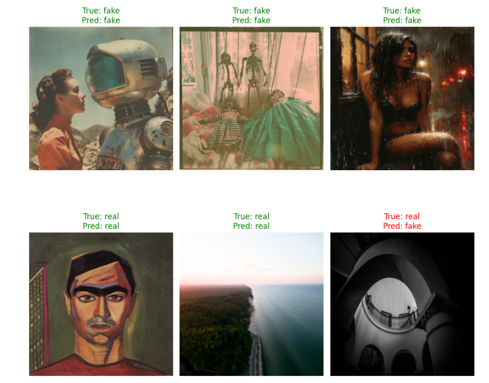
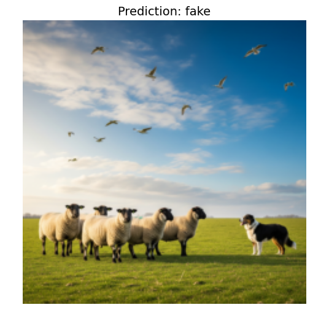

# 🕵️ FakeFinder  
### Deep Learning–Based Fake Image Detection with CNNs & Optuna

---

## 📌 Project Overview

**FakeFinder** is a deep learning project focused on detecting **fake versus real images** using a **custom Convolutional Neural Network (CNN)** implemented in **PyTorch**.  
The system is enhanced using **Optuna** for automated **hyperparameter optimization**, resulting in improved accuracy and generalization.

This repository contains a complete **end-to-end pipeline**, including data preprocessing, augmentation, model training, validation, testing, and optimization.

---

## 🎯 Objectives

- Build a custom CNN architecture for image classification  
- Apply data augmentation to improve robustness  
- Train and evaluate models using PyTorch  
- Optimize hyperparameters using Optuna  
- Achieve strong generalization on unseen test data  


---

## ⚙️ Technologies Used

- Python 3.x  
- PyTorch  
- Torchvision  
- NumPy  
- Optuna  
- Matplotlib  

---

## 🧪 Methodology

### 1. Data Preparation
- Images loaded using `ImageFolder`
- Dataset split into training, validation, and test sets
- Pixel normalization applied

### 2. Data Augmentation
- Random flips and rotations for training
- Minimal transformations for validation/testing

### 3. CNN Architecture
- Multiple convolutional layers
- ReLU activations
- Max pooling
- Dropout regularization
- Fully connected output layer

### 4. Training & Evaluation
- Loss: Cross-Entropy
- Optimizer: Adam
- Accuracy monitored on validation set

### 5. Hyperparameter Optimization
- Learning rate
- Batch size
- Dropout rate
- Number of filters

### 6. Final Testing
- Retraining using best hyperparameters
- Evaluation on test dataset

---

## ▶️ How to Run

```bash
pip install torch torchvision optuna numpy matplotlib
jupyter notebook C2M2_Assignment.ipynb
```

---

## 📚 Learning Outcomes

- Practical CNN implementation
- Importance of augmentation
- Automated hyperparameter tuning
- End-to-end deep learning workflow

---

## 👤 Author

**Your Name**  
C2M2 – Deep Learning Assignment  

---

## 📜 License

For academic and educational use only.
