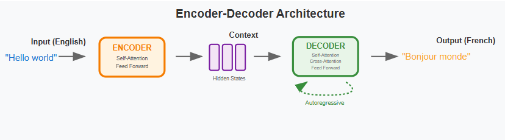

# Neural Machine Translation Using Transformer Architecture

## 📌 Project Overview

This project implements a **Neural Machine Translation (NMT) system** using the **Transformer architecture**, a state-of-the-art deep learning model based entirely on attention mechanisms. Unlike traditional RNN- or CNN-based models, the Transformer enables parallel computation and captures long-range dependencies efficiently.

The project demonstrates the complete workflow of a translation system, from text preprocessing to model training and inference, making it suitable for academic learning, portfolios, and professional review.

---

## 🎯 Objectives

- Build a Transformer-based translation model from scratch
- Understand and implement self-attention and multi-head attention
- Design a full encoder–decoder architecture
- Train the model using teacher forcing
- Evaluate translation performance during training
- Maintain clean, modular, and reproducible code

---

## 🧠 Dataset Description

- **Task:** Machine Translation (Source → Target Language)
- **Input:** Parallel sentence pairs
- **Output:** Translated sentences

### Preprocessing Steps
- Text normalization
- Tokenization
- Vocabulary construction
- Padding and masking
- Token-to-index conversion

---

## 🏗️ Transformer Architecture

```
Input Sentence
     ↓
Embedding + Positional Encoding
     ↓
Encoder Stack
     ↓
Decoder Stack
     ↓
Linear Layer + Softmax
     ↓
Translated Output
```

---

## 🔧 Core Components

### Embedding Layer
- Dense vector representation of tokens
- Separate embeddings for source and target languages

### Positional Encoding
- Encodes word order using sine and cosine functions

### Encoder
- Multi-head self-attention
- Feed-forward networks
- Residual connections and normalization

### Decoder
- Masked self-attention
- Encoder–decoder attention
- Feed-forward networks





---

## ⚙️ Training Pipeline

- **Loss:** Cross-entropy with padding mask
- **Optimizer:** Adam
- **Strategy:** Teacher forcing
- **Features:** Attention masks, batching, loss tracking


---

## 📈 Results

- Stable training convergence
- Meaningful translated outputs
- Effective attention alignment


---

## 🚀 How to Run

```bash
git clone <repository-url>
cd <repository-name>
jupyter notebook "Translation System using Transformer.ipynb"
```

---

## 📚 Learning Outcomes

- Deep understanding of Transformer architecture
- Attention-based sequence modeling
- NLP preprocessing pipelines
- Practical training strategies

---

## 🏁 Conclusion

This project presents a complete and professional implementation of a Transformer-based translation system, forming a solid foundation for advanced NLP applications.
